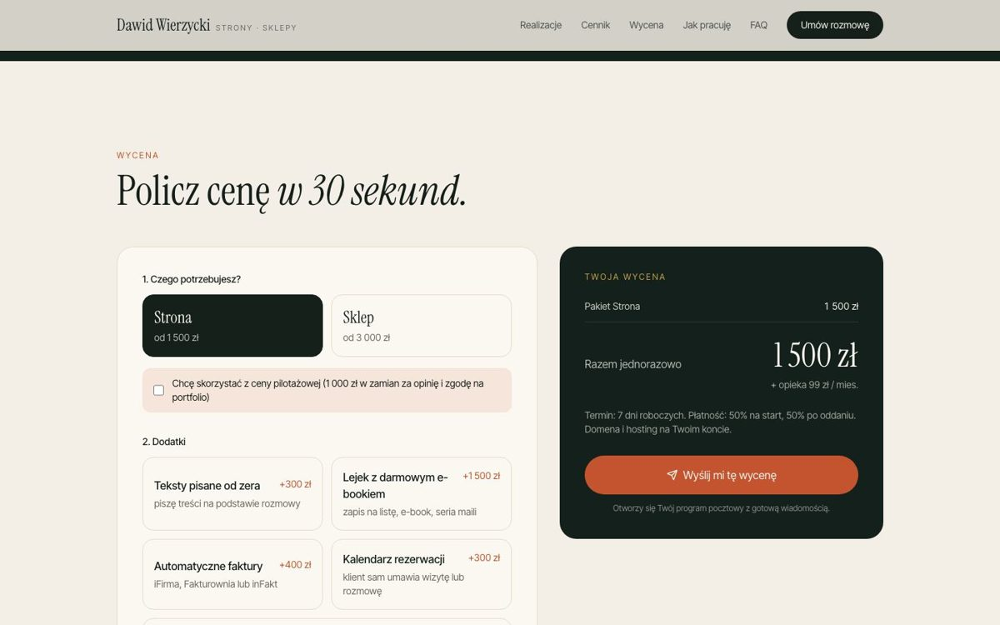

# dawidwierzycki.pl

Portfolio z ofertą stron i sklepów internetowych dla małych firm. Strona prowadzi klienta od pierwszego wrażenia, przez realizacje i cennik, do wyceny i rezerwacji rozmowy.

**👉 [dawidwierzycki.pl](https://dawidwierzycki.pl)**


## Co jest na stronie

- **Realizacje** z podglądem na komputerze i telefonie. Zrzut strony przewija się po najechaniu kursorem.
- **Kalkulator wyceny:** pakiet, dodatki, artykuły na blog i opieka. Cena liczy się na żywo, a przycisk otwiera gotowego maila z wyceną.
- **Kalendarz Cal.com** wbudowany w stronę. Rezerwacja rozmowy jest mierzona jako konwersja w GA4 i pikselu Meta.
- **4 działające koncepty stron** dla fikcyjnych firm: restauracja (rezerwacja stolika), kancelaria (kalendarz konsultacji), gabinet fizjoterapii (rezerwacja w 4 krokach) i palarnia kawy (koszyk, paczkomat, BLIK).
- **Baner zgód** z trybem zgody Google. GA4 i piksel Meta działają dopiero po kliknięciu „Akceptuję”.
- **Polityka prywatności** z tabelą plików cookies, dane firmy w stopce, dane strukturalne dla Google.




## Technologie

- [Next.js 15](https://nextjs.org) (eksport statyczny), React 19, TypeScript
- Tailwind CSS 4, Framer Motion
- Cal.com (wbudowany kalendarz), Google Analytics 4, piksel Meta
- Hosting: Hostinger, wdrożenie skryptem przez API Hostingera

## Struktura

| Ścieżka | Zawartość |
|---|---|
| `src/lib/content.ts` | wszystkie treści: realizacje, cennik, dodatki, FAQ, dane firmy |
| `src/components/` | sekcje strony, kalkulator, kalendarz, baner zgód |
| `src/components/koncepcje/` | 4 koncepty stron |
| `src/app/` | strona główna, polityka prywatności, koncepty |
| `public/` | zdjęcia, zrzuty realizacji, `.htaccess`, mapa strony |
| `scripts/deploy-hostinger.mjs` | wdrożenie na Hostinger |

## Uruchomienie

```bash
npm install
npm run dev        # http://localhost:3000
```

## Wdrożenie

```bash
npm run build                                   # strona statyczna w folderze out/
cd out && zip -qr /tmp/dawidwierzycki_deploy.zip . && cd ..
HOSTINGER_API_TOKEN=... node scripts/deploy-hostinger.mjs
```

Token API Hostingera nie jest przechowywany w repozytorium.

## Kontakt

Dawid Wierzycki · [dawidwierzycki.pl](https://dawidwierzycki.pl) · dawid@wierzycki.pl · [LinkedIn](https://www.linkedin.com/in/dawid-wierzycki/)

Zdjęcia w konceptach pochodzą z Openverse i są dostępne na licencji CC0.
